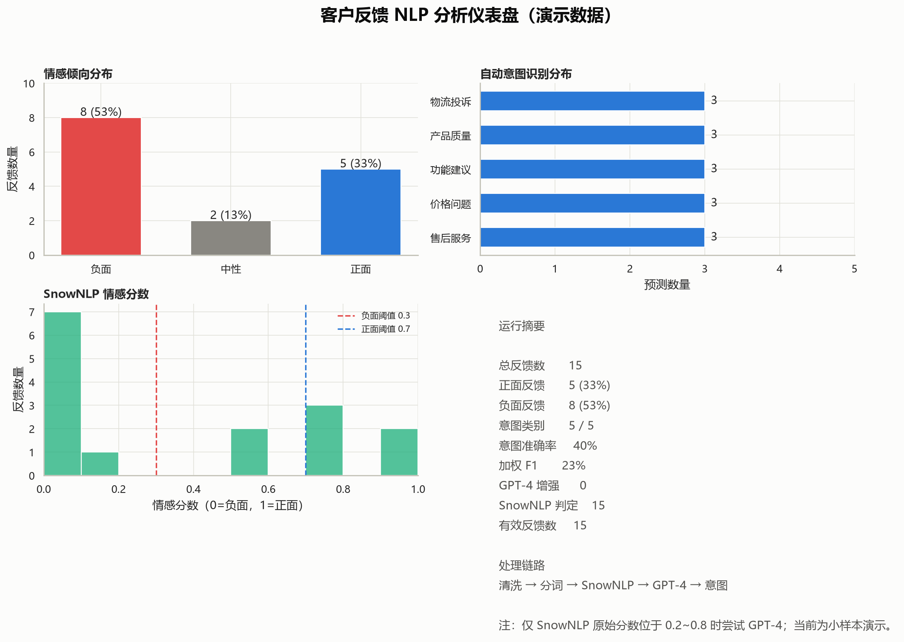

# 客户反馈 NLP 分析与自动分类系统

> 面向非结构化客户反馈的轻量级数据分析项目：从**数据质量检查**、**中文文本清洗**到**情感识别**、**意图分类**、**关键词洞察**和**可视化报告**，形成可本地复现的端到端分析闭环。

<p align="center">
  
  
  
  
  
</p>

---

## 项目解决什么问题？

客服评价、商品评论和售后反馈通常是非结构化文本，人工逐条阅读存在三类问题：

- **效率低**：难以快速统计负面反馈和主要问题类型；
- **口径不一致**：不同人员对情感和问题归类的判断可能不同；
- **难以行动**：原始文本无法直接转化为产品、运营或客服团队可使用的洞察。

本项目将反馈文本自动转换为可分析的数据结果：**情感倾向、问题意图、高频关键词、数据质量报告和模型误判样本**。

## 核心成果预览

> 以下为 15 条平衡演示数据的运行结果，仅用于展示完整分析链路，**不代表真实业务准确率或泛化性能**。

| 分析维度 | 演示结果 | 业务含义 |
| --- | ---: | --- |
| 有效反馈数 | 15 条 | 完成结构化读取、空值和重复记录校验 |
| 情感分布 | 负面 8（53%） / 中性 2（13%） / 正面 5（33%） | 可优先定位负面体验与服务风险 |
| 意图覆盖 | 5 类 | 物流投诉、产品质量、功能建议、价格问题、售后服务 |
| 高频关键词 | 太慢、质量、价格、售后、客服等 | 快速识别用户集中关注的痛点 |
| 数据分析交付 | 4 类文件 | 看板、词云、JSON 报告、误判样本 |

## 可视化结果

### 客户反馈分析仪表盘

<p align="center">
  
</p>

仪表盘集中展示情感分布、意图分布、SnowNLP 情感分数、数据质量和模型评估结果，便于快速回答：**负面反馈是否集中？用户主要抱怨什么？模型目前的识别效果如何？**

### 高频关键词词云

<p align="center">
  
</p>

词云将分词后的高频词可视化，帮助快速定位“太慢”“质量”“价格”“售后”“客服”等潜在体验问题。

---

## 分析流程

```text
原始反馈数据
    ↓
数据读取与质量校验
    ↓
文本清洗、中文分词、停用词过滤
    ↓
SnowNLP 情感初筛（0~1）
    ↓
GPT-4 边界样本增强（可选）
    ↓
TF-IDF 特征工程 + Logistic Regression 意图分类
    ↓
模型评估、误判样本、关键词与可视化报告
```

## 功能亮点

### 1. 数据质量分析

- 支持 **CSV / Excel / JSON** 格式数据接入；
- 校验必需字段 `text`、`intent`；
- 清理缺失值、空文本和重复记录；
- 输出样本数量、文本长度、意图分布等数据质量概览。

### 2. 中文文本预处理

- 清除 HTML 标签、URL、`@` / `#` 提及及无关符号；
- 使用 **Jieba** 进行中文分词；
- 过滤停用词、纯数字和过短词，生成可用于建模的标准化文本。

### 3. 两级情感分析：效率与准确性兼顾

- **第一级：SnowNLP 快速评分**
  - 对每条反馈输出 `0~1` 情感得分；
  - `< 0.3` 判为负面，`0.3~0.7` 判为中性，`> 0.7` 判为正面。
- **第二级：GPT-4 边界增强（可选）**
  - 仅当 SnowNLP 原始分数位于 `0.2~0.8` 时调用 GPT-4；
  - 对手机号、邮箱、长编号进行脱敏；
  - 校验模型返回 JSON，API 未配置、网络异常或格式异常时自动回退 SnowNLP。

### 4. 意图识别、模型评估与误判分析

- 使用 **TF-IDF + Logistic Regression** 识别五类业务意图：物流投诉、产品质量、功能建议、价格问题、售后服务；
- 按训练集 / 验证集划分输出 **Accuracy、Precision、Recall、F1 和混淆矩阵**；
- 自动导出 `misclassified_samples.csv`，为后续补充标注、优化类别体系和分析模型短板提供依据。

### 5. 可交付的数据分析结果

每次运行自动产出：

| 文件 | 用途 |
| --- | --- |
| `outputs/dashboard.png` | 情感、意图、分数与摘要看板 |
| `outputs/wordcloud.png` | 高频关键词词云 |
| `outputs/analysis_report.json` | 数据质量、模型指标和关键词机器可读报告 |
| `outputs/misclassified_samples.csv` | 验证集误判样本，支持错误分析 |

## 技术栈

| 模块 | 技术 |
| --- | --- |
| 数据处理 | Python、Pandas、NumPy |
| 中文 NLP | Jieba、SnowNLP |
| 特征工程与建模 | TF-IDF、Scikit-learn、Logistic Regression |
| LLM 增强 | OpenAI API / GPT-4（可选） |
| 可视化 | Matplotlib、Seaborn、WordCloud |
| 质量保障 | unittest、JSON 报告、误判样本导出 |

## 项目结构

```text
customer_feedback_nlp/
├── app.py                 # 项目入口：编排完整分析流程
├── config.py              # 路径、阈值、类别、模型等配置
├── data_loader.py         # 多格式读取、校验、去重与质量统计
├── preprocess.py          # 文本清洗与 Jieba 分词
├── sentiment.py           # SnowNLP + GPT-4 两级情感分析
├── intent.py              # TF-IDF、逻辑回归和验证集评估
├── keywords.py            # 高频关键词提取
├── metrics.py             # 数据质量、指标、误判导出与报告写出
├── visualization.py       # 仪表盘和中文词云
├── data/
│   └── sample_feedback.csv
├── assets/                # README 展示用示例图
├── outputs/               # 每次运行自动生成，不提交
└── tests/                 # 基础单元测试
```

## 快速开始

### 1. 安装依赖

建议使用 Python 3.10+：

```bash
python -m venv .venv

# Windows PowerShell
.venv\Scripts\Activate.ps1

# macOS / Linux
# source .venv/bin/activate

pip install -r requirements.txt
```

### 2. 运行项目

```bash
python app.py
```

### 3. 运行测试

```bash
python -m unittest discover -s tests -p "test_*.py" -v
```

## 数据格式

最小数据格式如下：

```csv
text,intent
物流太慢了，等了两周,物流投诉
收到的商品破损了，包装质量很差,产品质量
希望增加夜间模式，晚上使用更方便,功能建议
```

- `text`：客户原始反馈文本；
- `intent`：人工标注的意图类别，用于训练和验证意图分类模型；
- 正式使用时可替换为 CSV、Excel 或 JSON 数据文件，并在 `config.py` 中调整路径。

## 启用 GPT-4 增强（可选）

复制 `.env.example` 为 `.env`，或直接设置环境变量：

```bash
OPENAI_API_KEY=your-api-key-here
OPENAI_MODEL=gpt-4
```

> 不要将真实 API Key 写入源码、README 或提交到 GitHub。未配置 API Key 时，项目会自动使用 SnowNLP 完成全部本地分析流程。

## 当前限制与后续优化

- 当前仅包含 15 条平衡演示数据，因此验证集的分类指标仅用于展示评估链路；
- 不应将演示结果作为真实业务准确率写入简历；
- 实际应用中应引入规模更大的人工标注数据，按类别分层划分训练/测试集，并结合 F1、混淆矩阵与误判样本持续优化；
- 可进一步增加数据采集、数据库存储、模型持久化、Web 看板和定时任务，形成完整的数据产品流程。

## 简历描述参考

> 构建客户反馈 NLP 分析与自动分类系统，使用 Pandas 完成多格式数据接入、缺失/重复记录校验和数据质量统计；基于 Jieba、SnowNLP、TF-IDF 与 Logistic Regression 实现文本清洗、情感识别和五类反馈意图分类，并引入 GPT-4 对边界样本进行可选增强、脱敏和异常回退；输出模型评估、误判样本、关键词词云及可视化分析看板，形成可复现的端到端数据分析流程。

## License

本项目采用 [MIT License](LICENSE)。
